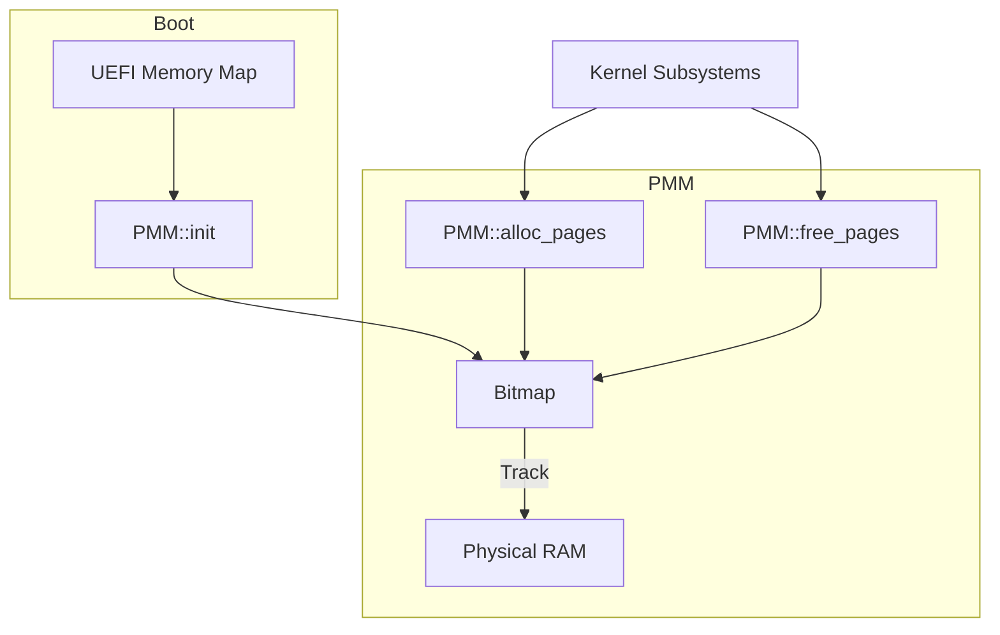

# Physical Memory Manager (PMM) Design

## Overview

The Physical Memory Manager (PMM) in AxiomOS uses a **First-Fit Bitmap** to track physical memory frames (4KiB). It is designed to be efficient for boot-time and early kernel development, with abstraction hooks for future scaling.

## Design

- **Tracking:** Bitmap where 1 bit = 1 page (4KiB).
- **Search:** First-fit scanning for free blocks.
- **UEFI Integration:** Direct mapping of UEFI memory descriptors to bitmap status.

## Considerations & Refinements

1. **First-Fit Latency ($O(n)$):** We will implement a "last hint" index for the search. Bit-hunting within 64-bit chunks will use `__builtin_ctzll` for hardware acceleration.
2. **Contiguous Allocation:** The PMM interface will remain abstract, allowing a future migration to a **Buddy Allocator** if fragmentation becomes critical.
3. **Multi-core (SMP) Scaling:** Initially single-threaded with spinlock protection, the design is structured to allow partitioning the bitmap into "zones" to reduce contention later.
4. **UEFI "Hole" Problem:** Bitmap size calculation is based on the *highest* physical address found in the UEFI map, not just total reported RAM.
5. **Alignment:** The bitmap itself will be page-aligned and marked "reserved" to prevent accidental allocation.

## Architecture

