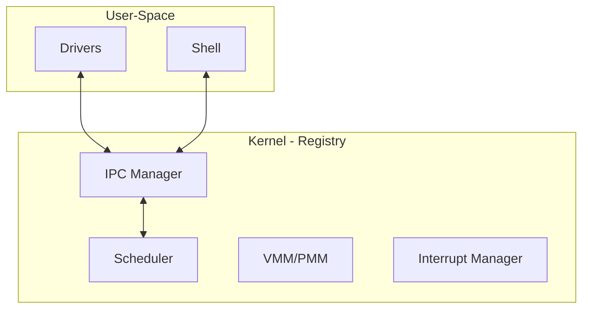

# Registry Kernel Architecture Design

The Registry is the core micro-monolithic kernel of AxiomOS.

## Architecture Overview

The Registry manages core hardware-level resources (CPU, Memory, Interrupts) and provides a secure, lock-free IPC channel for user-space communication. Peripheral interaction is delegated to isolated user-space "Plug-ins".

## Core Subsystems

1. **Scheduler:** Lock-free, preemptive task scheduling based on per-CPU runqueues.
2. **VMM/PMM:** Higher-half kernel mapping (`0xFFFFFFFF80000000`) with strict separation of kernel/user address spaces.
3. **IPC Manager:** Shared memory transport, providing zero-copy communication buffers between user-space plug-ins and kernel services.
4. **Interrupt Manager:** Manages APIC/IOAPIC mappings and dispatches interrupts to registered user-space plug-ins.

## Design Principles

- **Absolute Ring 0 Authority:** Registry handles critical CPU state; user-space drivers never interact with hardware directly.
- **Lock-Free by Default:** Critical paths (IPC/Scheduler) utilize lock-free queues to prevent kernel contention.
- **Micro-Monolithic:** Core performance services are tightly integrated (monolithic), while I/O interaction is modularized (plug-ins).
- **Hardened Security:** All IPC messages are validated, and user-space drivers are sandboxed via IOMMU (TBD).
