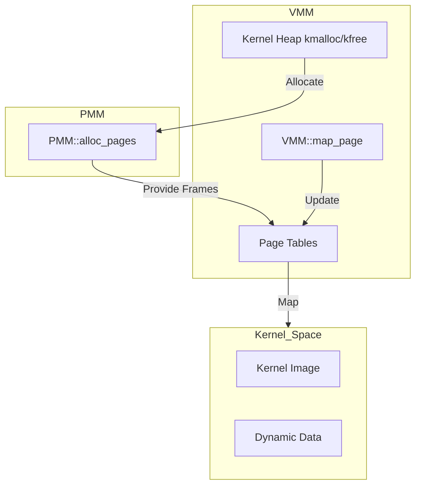

# Virtual Memory Manager (VMM) Design

## Overview

The Virtual Memory Manager (VMM) in AxiomOS provides abstraction over physical memory, enabling isolated address spaces for processes and kernel management via demand paging and dynamic allocation. It leverages x86_64 4-level paging structures.

## Design

- **Paging:** Standard x86_64 4-level paging (PML4, PDPT, PD, PT).
- **Recursive Paging:** The last entry of the PML4 points back to the PML4 itself, allowing the kernel to access all page tables as virtual memory by navigating a specific address structure.
- **Kernel Heap:** A **Slab/Magazine Allocator** will be implemented. It pre-allocates slabs of memory for specific object types and uses per-core "magazines" to minimize lock contention across the 2P/4E cores, ensuring cache-aligned performance for the 12th Gen Alder Lake architecture.
- **Dynamic Mapping:** A `map_page` function will allow the kernel to map specific physical frames to virtual addresses on demand.
- **PMM Interaction:** The VMM requests new frames from the Physical Memory Manager (PMM) when page tables need expanding or new mappings are created.

## Architecture

## Modular Hardware Abstraction

To ensure AxiomOS remains portable, the VMM will be structured into a **Hardware Abstraction Layer (HAL)**.

- **Paging Policies:** Paging structures, `invlpg` routines, and TLB management will be encapsulated behind a `VirtualMemoryHAL` interface.
- **Hardware-Specific Modules:** Porting to new hardware will involve implementing a new `arch` module that satisfies the `VirtualMemoryHAL` interface.
- **Drop-in replacement:** The kernel will query the HAL at compile-time (using C++ concepts or template specialization) to select the appropriate hardware driver.

1. **Recursive Paging Security:** Careful mapping of the recursive entry to prevent userspace access.
2. **TLB Management:** Ensure `invlpg` instructions are used when updating page tables to maintain consistency.
3. **PMM Integration:** Tight coupling between VMM's `map_page` and PMM's `alloc_pages`.
